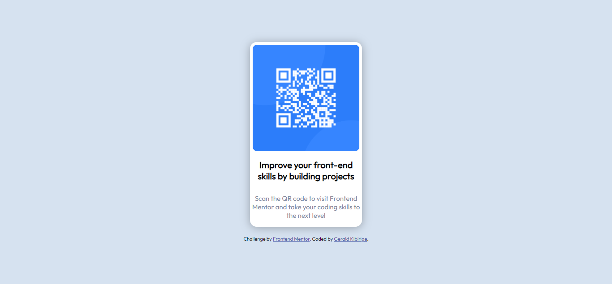
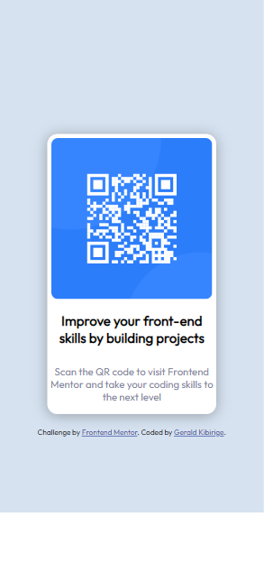

# Frontend Mentor - QR code component solution

This is a solution to the [QR code component challenge on Frontend Mentor](https://www.frontendmentor.io/challenges/qr-code-component-iux_sIO_H). Frontend Mentor challenges help you improve your coding skills by building realistic projects. 

## Table of contents

- [Overview](#overview)
  - [Screenshots](#screenshots)
  - [Links](#links)
- [My process](#my-process)
  - [Built with](#built-with)
  - [What I learned](#what-i-learned)
  - [Continued development](#continued-development)
  - [Useful resources](#useful-resources)
- [Author](#author)
- [Acknowledgments](#acknowledgments)

**Note: Delete this note and update the table of contents based on what sections you keep.**

## Overview

### Screenshots




### Links

- Solution URL: [Add solution URL here](https://www.frontendmentor.io/solutions/responsive-qr-code-component-with-css-flexbox-A4QsbVwJnX)
- Live Site URL: [Add live site URL here](https://geraldjosephk.github.io/QR-code-component/)

## My process

### Built with

- Semantic HTML5 markup
- CSS custom properties
- Flexbox

### What I learned

- CSS Flexbox

```css
* {
    box-sizing: border-box;
}

body {
    font-family: 'Outfit', sans-serif;
    font-weight: 400;
    background-color: hsl(212,45%, 89%);
    display: flex;
    flex-direction: column;
    align-items: center;
    justify-content: center;
    min-height: 100vh;
    overflow: hidden;
    margin: 0;
    
}

```

### Continued development

Areas to shapen; CSS and Vanilla JavaScript

### Useful resources

- [web.dev](https://web.dev/learn/css/flexbox/) - Concise CSS goldmine.  Number one stop for CSS refresher.

## Author

- Website - [Gerald Kibirige](https://g.dev/geraldjosephk)
- Frontend Mentor - [@](https://www.frontendmentor.io/profile/geraldjosephk)
- Twitter - [@geraldjosephk](https://www.twitter.com/geraldjosephk)

## Acknowledgments

Shout out to Brad Traversy
